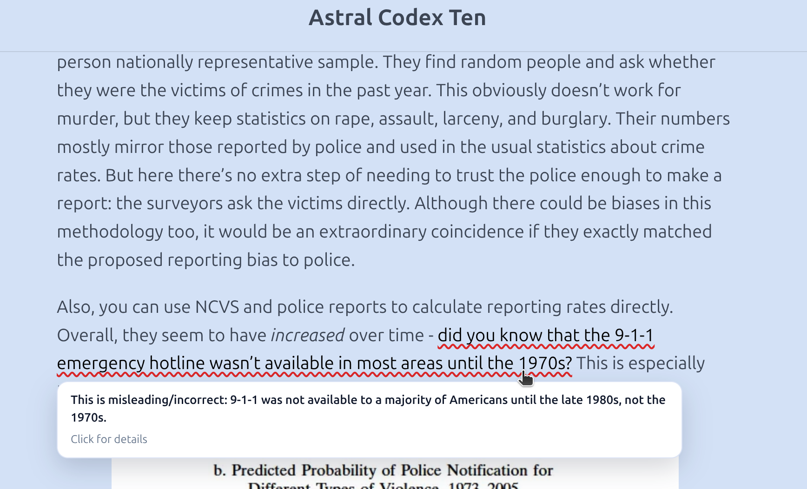

# OpenErrata

<p align="center">
  
  <br />
  <em>OpenErrata highlighting an incorrect claim on Astral Codex Ten</em>
</p>

OpenErrata is a browser extension that uses LLMs to pre-investigate posts from
the sites you read, and underlines unambiguously incorrect claims, with sources
available. It prioritizes an extremely low false-positive rate over coverage,
and its prompts, details, and reasoning behind every investigation made
inspectable by users.

## Install

**Chrome Web Store** — Coming soon.

**Manual install** from [GitHub Releases](https://github.com/ZeroPathAI/openerrata/releases):

1. Download the latest `openerrata-extension-*.zip` from the [Releases page](https://github.com/ZeroPathAI/openerrata/releases)
2. Unzip the file
3. Open `chrome://extensions` in Chrome
4. Enable **Developer mode** (toggle in the top-right)
5. Click **Load unpacked** and select the unzipped folder
6. (Optional) Set your [OpenAI API Key](https://developers.openai.com/api/docs/quickstart) in the settings 

Errata are first pulled from the public instance before being regenerated. If
you do not have an OpenAI API key, you can receive the errata generated by
other users, but they won't be generated on demand. Right now the public
instance is configured to investigate the most popular posts every hour (though
this may change as we hit spend thresholds).

To point the extension at a self-hosted instance, open the extension options
page and change the API URL.

## How It Works

1. **You browse normally.** The extension detects supported posts and sends
   observed content to the API, which records views and returns any existing
   investigation results triggered by other users.
2. **Posts get investigated.** You or someone else clicks "Investigate Now", or
   has the "auto-investigate posts" setting checked, or the service pre-selects
   it using a very-likely-to-be-read heuristic.
3. **The LLM investigates.** The full post text (plus images) are sent to
   GPT-5.2, which uses native web search and browsing tools to verify claims.
   Only demonstrably incorrect claims are flagged — disputed, ambiguous, or
   unverifiable claims are left alone.
4. **Incorrect claims are highlighted.** For all extension users, every
   incorrect sentence gets a red underline in the post. Hover for a summary;
   click for full reasoning and sources.

## Public API

All complete investigations are publicly accessible via GraphQL at `POST
/graphql`. No authentication required. Responses include trust signals (content
provenance, corroboration count, server verification timestamps) so consumers
can apply their own trust policy.

## Supported Platforms

| Platform | Detection |
|----------|-----------|
| LessWrong | URL match (`lesswrong.com`) |
| X (Twitter) | URL match (`x.com`, `twitter.com`) |
| Substack | URL match (`*.substack.com/p/*`) + DOM fingerprint for custom domains |

## Design Principles

- **When in doubt, don't flag.** False positives erode trust and will be adversarially scrutinized. The system only flags claims with concrete, credible counter-evidence.
- **Only flag sentences that would otherwise mislead readers.** Don't flag e.g. clearly satirical or humorous posts.
- **Transparency.** The design, spec, code, and individual investigations are
  all publicly inspectable. Every investigation stores full audit artifacts
  (prompt, model metadata, tool traces, source snapshots).
- **Lean on frontier models.** The LLM uses provider-native web search and
  browsing rather than a custom search-and-scrape pipeline. We orchestrate; the
  model investigates.
- **Single-pass investigation.** The entire post is investigated in one agentic
  call, giving the model full context for understanding caveats,
  qualifications, and claim relationships.

## Documentation

- **[SPEC.md](SPEC.md)** — Full product spec covering design goals, architecture, data model, API surface, and implementation details. This is the source of truth for product behavior.

## Repository Layout

```
src/
├── helm/openerrata/         # Helm chart (single artifact for on-prem + hosted)
└── typescript/
    ├── shared/              # @openerrata/shared — types, Zod schemas, normalization
    ├── api/                 # @openerrata/api — SvelteKit + tRPC backend, Prisma, job queue
    ├── extension/           # @openerrata/extension — Chrome MV3 browser extension
    └── pulumi/              # @openerrata/pulumi — deploys the Helm chart for hosted env
```

The monorepo uses **pnpm workspaces**. Dependencies flow: `shared` -> `api` and `shared` -> `extension`.

## Tech Stack

| Layer | Technology |
|-------|-----------|
| Extension UI | Svelte 5, component-scoped CSS |
| Extension build | Vite (multi-entry MV3 build) |
| Cross-browser | webextension-polyfill |
| Type safety | TypeScript + Zod |
| API | SvelteKit + tRPC (internal) + GraphQL (public) |
| Database | Postgres + Prisma |
| Job queue | Postgres-backed (graphile-worker) |
| LLM | OpenAI Responses API with native tool use |
| Deployment | Helm chart (on-prem), Pulumi (hosted) |

## Getting Started

### Prerequisites

- [Node.js](https://nodejs.org/) (LTS)
- [pnpm](https://pnpm.io/)
- [Docker](https://www.docker.com/) (for local Postgres + MinIO)

### Local Development

```bash
# Start Postgres (port 5433) and MinIO S3-compatible storage (ports 9000/9001)
docker compose up -d

# Install dependencies
cd src/typescript
pnpm install

# Apply database migrations
pnpm db:migrate

# Start the API dev server
pnpm dev:api

# Build the extension in watch mode (separate terminal)
pnpm dev:ext

# Start the job queue worker (separate terminal)
pnpm worker
```

### Common Commands

```bash
pnpm check              # Typecheck all packages + lint
pnpm lint:fix            # ESLint with auto-fix
pnpm test               # Run unit + integration tests
pnpm selector            # Run investigation selector (cron equivalent)
pnpm db:migrate          # Create/apply Prisma migrations
pnpm db:migrate:deploy   # Apply SQL migrations (e.g. Postgres views)
pnpm db:generate         # Regenerate Prisma client
```

### Loading the Extension

After `pnpm dev:ext`, load the built extension as an unpacked extension in Chrome:

1. Navigate to `chrome://extensions`
2. Enable "Developer mode"
3. Click "Load unpacked" and select the extension build output directory

## Deployment

The Helm chart at `src/helm/openerrata/` is the single deployment artifact for both on-prem and hosted environments. It does not bundle a database — it takes a `DATABASE_URL` as config.

**On-prem:**
```bash
helm install openerrata ./src/helm/openerrata \
  --set secrets.databaseUrl="postgresql://..." \
  --set secrets.openaiApiKey="sk-..."
```

**Hosted:** The official hosted deployment uses Pulumi (`src/typescript/pulumi/`) to deploy the same Helm chart with hosted-specific overrides (Supabase connection, domain, TLS, autoscaling). This guarantees identical workload definitions between on-prem and hosted — no deployment drift.

## License

[GNU Affero General Public License v3.0](LICENSE)
