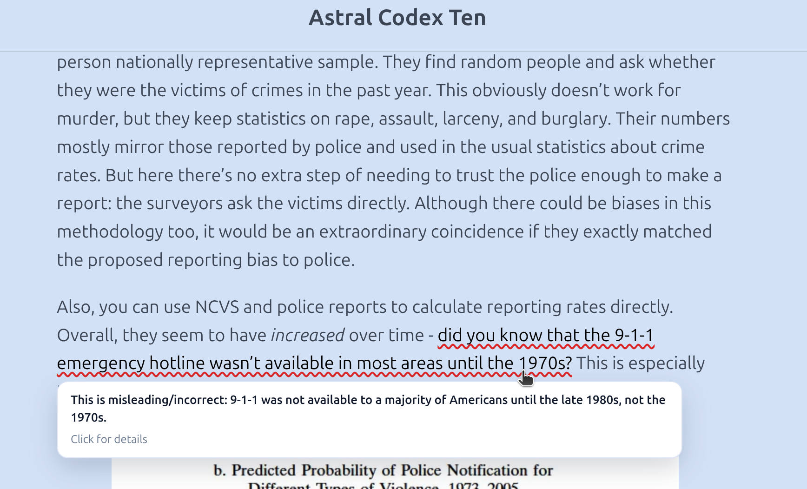

# OpenErrata

<p align="center">
  
  <br />
  <em>OpenErrata highlighting an incorrect claim on Astral Codex Ten</em>
</p>

OpenErrata is a browser extension that uses LLMs to pre-investigate posts from
the sites you read, and underlines unambiguously incorrect claims, with sources
available. It prioritizes an extremely low false-positive rate over coverage,
and the prompts, details, and reasoning behind every investigation are
inspectable by users.

## How It Works

1. **You browse normally.** The extension detects supported posts and sends
   observed content to the API, which records views and returns any existing
   investigation results triggered by other users.
2. **Posts get investigated.** You or someone else clicks "Investigate Now", or
   has the "auto-investigate posts" setting checked, or the service pre-selects
   it using a very-likely-to-be-read heuristic.
3. **The LLM investigates.** The full post text (plus images) is sent to
   OpenAI's `gpt-6.1-sol`, which uses native web search and browsing tools to
   verify claims. Each flagged claim is then re-checked in a separate validation
   pass. Only demonstrably incorrect claims are flagged — disputed, ambiguous, or
   unverifiable claims are left alone.
4. **Incorrect claims are highlighted.** For all extension users, every
   incorrect sentence gets a red underline in the post. Hover for a summary;
   click for full reasoning and sources.

## Install

**[Chrome Web Store](https://chromewebstore.google.com/detail/openerrata/iflopmpcoifkihfimncdjkokibdfkkbd)** — Install directly from the store.

**Firefox Add-ons (AMO)** — Coming soon.

**Manual install** from [GitHub Releases](https://github.com/ZeroPathAI/openerrata/releases):

1. Download the latest browser-specific zip from the [Releases page](https://github.com/ZeroPathAI/openerrata/releases):
   - Chrome: `openerrata-extension-chrome-*.zip`
   - Firefox: `openerrata-extension-firefox-*.zip`
2. Unzip the file
3. Install by browser:
   - Chrome: open `chrome://extensions`, enable **Developer mode**, then click **Load unpacked** and select the unzipped folder.
   - Firefox: open `about:debugging#/runtime/this-firefox`, click **Load Temporary Add-on...**, then choose the extension `manifest.json` in the unzipped folder.
4. (Optional) Set your [OpenAI API Key](https://developers.openai.com/api/docs/quickstart) in the settings

Errata are first pulled from the public instance before being regenerated. If
you do not have an OpenAI API key, you can receive the errata generated by
other users, but they won't be generated on demand. The public instance also
investigates the most-viewed posts on its own, up to a daily budget.

To point the extension at a self-hosted instance, open the extension options
page and change the API URL.

## Supported Platforms

| Platform | Detection |
|----------|-----------|
| LessWrong | URL match (`lesswrong.com`) |
| X (Twitter) | URL match (`x.com`, `twitter.com`) |
| Substack | URL match (`*.substack.com/p/*`) + DOM fingerprint for custom domains |
| Wikipedia | URL match (`*.wikipedia.org/wiki/*`, `*.wikipedia.org/w/index.php*`) |

## Public API and site

All complete investigations are publicly accessible via GraphQL at `POST
/graphql` on the API. No authentication required. Responses include trust
signals (content provenance, corroboration count, server verification
timestamps) so consumers can apply their own trust policy. The public website
(`src/typescript/frontend`) is a client of this API: it lists corrections and
shows each investigation's claims, reasoning and sources.

## Design Principles

- **When in doubt, don't flag.** False positives erode trust and will be adversarially scrutinized. The system only flags claims with concrete, credible counter-evidence.
- **Only flag sentences that would otherwise mislead readers.** Don't flag e.g. clearly satirical or humorous posts.
- **Transparency.** The design, spec, code, and individual investigations are
  all publicly inspectable. Every investigation stores full audit artifacts
  (prompt, model metadata, tool traces, source snapshots).
- **Lean on frontier models.** The LLM uses provider-native web search and
  browsing rather than a custom search-and-scrape pipeline. We orchestrate; the
  model investigates.
- **Single-pass investigation.** The entire post is investigated in one agentic
  call, giving the model full context for understanding caveats,
  qualifications, and claim relationships; each resulting claim is then
  validated on its own.

## Documentation

- **[SPEC.md](SPEC.md)** — Full product spec covering design goals, architecture, data model, API surface, and implementation details. This is the source of truth for product behavior.

## Repository Layout

```
src/
├── aws/ci-iam/              # Bootstrap of the IAM role hosted deploys assume (GitHub OIDC)
├── helm/openerrata/         # Helm chart (single artifact for on-prem + hosted)
├── kubernetes/ci-rbac/      # RBAC for the hosted deploy role's Kubernetes group
└── typescript/
    ├── shared/              # @openerrata/shared — types, Zod schemas, normalization
    ├── api/                 # @openerrata/api — SvelteKit + tRPC backend, Prisma, job queue
    ├── extension/           # @openerrata/extension — WebExtension (Chrome + Firefox)
    ├── frontend/            # @openerrata/frontend — public SvelteKit website
    └── pulumi/              # @openerrata/pulumi — deploys the Helm chart for hosted env
```

The monorepo uses **pnpm workspaces**. Dependencies flow from `shared` to
`api`, `extension` and `frontend`.

## Tech Stack

| Layer | Technology |
|-------|-----------|
| Extension UI | Svelte 5, component-scoped CSS |
| Extension build | Vite (multi-entry MV3 build) |
| Cross-browser | webextension-polyfill |
| Type safety | TypeScript + Zod |
| API | SvelteKit + tRPC (internal) + GraphQL (public) |
| Public website | SvelteKit (server-rendered, reads the public GraphQL API) |
| Database | Postgres + Prisma |
| Job queue | Postgres-backed (graphile-worker) |
| LLM | OpenAI Responses API with native tool use |
| Deployment | Helm chart (on-prem), Pulumi (hosted) |

## Getting Started

### Prerequisites

- [Node.js](https://nodejs.org/) (LTS)
- [pnpm](https://pnpm.io/)
- [Docker](https://www.docker.com/) (for local Postgres + S3-compatible blob storage)

### Local Development

```bash
# Start Postgres (port 5433) and S3-compatible blob storage (port 7070)
docker compose up -d

# Install dependencies
cd src/typescript
pnpm install

# Configure the API, worker and selector. dotenv reads api/.env; the example
# matches docker-compose. Set OPENAI_API_KEY in it to run the worker.
cp api/.env.example api/.env

# Apply database migrations
pnpm db:migrate

# Start the API dev server
pnpm dev:api

# Build the extension in watch mode (separate terminal)
pnpm dev:ext

# Start the job queue worker (separate terminal)
pnpm worker

# Start the public website against the local API (separate terminal)
API_BASE_URL=http://localhost:5173 pnpm dev:frontend
```

### Common Commands

```bash
pnpm check              # Typecheck all packages + lint
pnpm lint:fix            # ESLint with auto-fix
pnpm test               # Run unit + integration tests
pnpm selector            # Run investigation selector (cron equivalent)
pnpm db:migrate          # Create/apply Prisma migrations
pnpm db:migrate:deploy   # Apply SQL migrations (e.g. Postgres views)
pnpm db:generate         # Regenerate Prisma client
```

### Loading the Extension

After `pnpm dev:ext`, load the built extension as an unpacked extension:

1. Chrome:
   - Navigate to `chrome://extensions`
   - Enable "Developer mode"
   - Click "Load unpacked" and select `src/typescript/extension/dist`
2. Firefox:
   - Navigate to `about:debugging#/runtime/this-firefox`
   - Click "Load Temporary Add-on..."
   - Select `src/typescript/extension/dist/firefox/manifest.json`

For signed Firefox releases, set `FIREFOX_GECKO_ID=<your-addon-id>` before
building to control the generated `browser_specific_settings.gecko.id`.

### Releasing the Extension

Push a tag `ext-v<version>` (e.g. `ext-v0.4.0`). The Release Extension workflow
tests and packages the extension and creates a GitHub release with the Chrome
zip and `.crx` and the Firefox zip as assets. Store publishing is opt-in per
store, through variables on the `extension-store-publish` environment:

- `PUBLISH_TO_CHROME_WEB_STORE=true` uploads and publishes the Chrome zip; it
  needs the secrets `CHROME_EXTENSION_ID`, `CHROME_CLIENT_ID`,
  `CHROME_CLIENT_SECRET` and `CHROME_REFRESH_TOKEN`.
- `PUBLISH_TO_FIREFOX_AMO=true` signs and lists the Firefox zip on AMO; it needs
  `FIREFOX_JWT_ISSUER` and `FIREFOX_JWT_SECRET`.

An enabled store with a missing secret fails the release. With neither enabled,
the release finishes once the GitHub release exists; upload its assets to the
stores by hand.

## Deployment

The Helm chart at `src/helm/openerrata/` is the single deployment artifact for both on-prem and hosted environments. It does not bundle a database or blob storage — it takes a `DATABASE_URL` and an S3-compatible bucket as config. `values.yaml` documents every value; these are required:

**On-prem:**
```bash
helm install openerrata ./src/helm/openerrata \
  --set image.tag=main-latest \
  --set config.blobStorageProvider=aws \
  --set config.blobStorageRegion=us-east-1 \
  --set config.blobStorageBucket=my-openerrata-images \
  --set secrets.databaseUrl="postgresql://..." \
  --set secrets.openaiApiKey="sk-..." \
  --set secrets.databaseEncryptionKey="$(openssl rand -hex 32)" \
  --set secrets.blobStorageAccessKeyId="..." \
  --set secrets.blobStorageSecretAccessKey="..."
```

Images are published as `ghcr.io/zeropathai/openerrata-api` (and `-frontend`) with `main-<sha>` and `main-latest` tags. Database migrations run as a Helm hook, after the first install and before each upgrade; workload pods wait for them, so don't pass `--wait` to the first `helm install`. The public website is off by default (`frontend.enabled`).

**Hosted:** The official hosted deployment uses Pulumi (`src/typescript/pulumi/`) to deploy the same Helm chart, plus the hostnames, Cloudflare DNS, and (optionally) a managed RDS database and S3 bucket. `.github/workflows/deploy.yml` configures the `staging` and `main` stacks on every deploy from repository and environment secrets and variables. This guarantees identical workload definitions between on-prem and hosted — no deployment drift.

The deploy job holds no long-lived cloud credentials. It requests a GitHub OIDC token, whose subject names its `main` or `staging` deployment environment, and uses it twice:

- to join the tailnet as `tag:ci`, because the EKS cluster `cunningham` (`us-west-2`) has a private API endpoint;
- to assume the IAM role `openerrata-github-actions-deploy`, whose policy covers only the AWS resources Pulumi manages. The role's EKS access entry maps it to the Kubernetes group `openerrata-ci`, which `src/kubernetes/ci-rbac/rbac.yaml` allows into the `openerrata-main` and `openerrata-staging` namespaces only.

The managed RDS databases accept connections only from the cluster VPC (`10.0.0.0/16`, over VPC peering) and are not publicly accessible; reach them from inside the cluster. The managed blob buckets block all public access.

### Hosted deploy setup

Run these in order. Steps 1–2 need admin access and are idempotent; rerun them after changing the IAM policy or RBAC.

1. **AWS role.** With an admin AWS session for the account hosting `cunningham`, run `src/aws/ci-iam/setup.sh`. It creates or updates the role, its policy and its EKS access entry, prints the role ARN to stdout, and prints (without running) the commands that delete the retired `openerrata-ci` IAM user.
2. **Kubernetes RBAC.** With a cluster-admin kubeconfig for `cunningham` (on the tailnet), run `src/kubernetes/ci-rbac/setup.sh`. It creates the two namespaces, binds the RBAC to group `openerrata-ci`, and deletes the retired `openerrata-ci` ServiceAccount and its token Secret.
3. **Tailscale.** Create a workload-identity (OIDC) trust credential with issuer GitHub Actions, tag `tag:ci`, and a subject matching the deploy job's tokens (`repo:ZeroPathAI/OpenErrata:environment:main` and `repo:ZeroPathAI/OpenErrata:environment:staging`). Store its client ID and audience as the repository secrets `TS_OAUTH_CLIENT_ID` and `TS_AUDIENCE`.
4. **Repository variables.** Set
   - `AWS_DEPLOY_ROLE_ARN` to the ARN from step 1;
   - `PULUMI_MANAGED_DATABASE_PUBLICLY_ACCESSIBLE=false`;
   - `PULUMI_MANAGED_DATABASE_INGRESS_CIDRS=10.0.0.0/16`;
   - `PULUMI_MANAGED_DATABASE_ENGINE_VERSION=17`.

   The deploy job fails early if the role variable or either Tailscale secret is missing, and the Pulumi step fails if a managed-database variable is.
5. **Deploy** `staging` (a push to the `staging` branch, or a manual run of the Deploy workflow), check it, then `main`.
6. **Retire the static credentials.** Delete the repository secrets `AWS_ACCESS_KEY_ID`, `AWS_SECRET_ACCESS_KEY`, `AWS_REGION` and `KUBE_CONFIG_DATA`, which no workflow reads any more, and run the cleanup commands step 1 printed.

### Legacy extension traffic

Extensions older than 0.4.0 are served through a time-boxed adapter
(`api/src/lib/trpc/legacy-extension-v0`), to be retired on 2026-12-01 or once
14 consecutive days pass with no requests from them, whichever is later. This
query lists the days in the last 14 with legacy (0.2.x/0.3.x) page views; no
rows means the traffic is gone:

```sql
SELECT "day", "version", "pageViewCount" FROM "ExtensionVersionDailyCount"
WHERE "version" ~ '^0\.[23](\.|$)' AND "day" > (CURRENT_TIMESTAMP AT TIME ZONE 'UTC')::date - 14
ORDER BY "day", "version";
```

## License

[GNU Affero General Public License v3.0](LICENSE)
